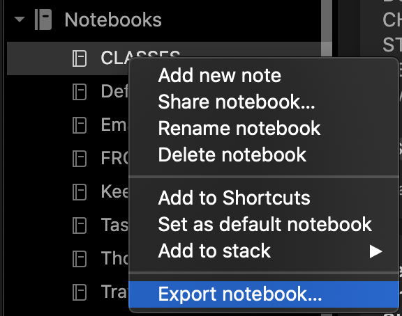
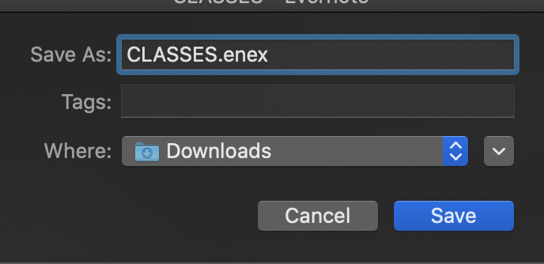

# Request ID Helper

## Setup

> This has been created on a Mac, for a Mac.

> You will need to use the Evernote Desktop App.  If you don't have this installed, please [visit Evernote's site and download it](https://evernote.com/download)

# Right/Option click the icon and choose _Save Link As..._ 

## How to use this tool

1. Open the Evernote app.
2. On the sidebar, right/option click on the Notebook of your choice.

3. Choose to export the .enex file type.

4. Be sure this file is going into your Downloads folder! (This location is important!)

5. Did you download the script yet?  If you haven't done that - you can right click [HERE](https://raw.githubusercontent.com/thehandsomezebra/Request_ID_Helper/main/script.sh) and choose _Save Link As..._
6. Now that you have your export file in the *Downloads* folder, and you have the _script.sh_ file... go ahead and click to run it.
7. It will prompt you to pick the correct file -- just type the corresponding number and hit Enter.
8. The script do some magic in the background, and then drop a new file on your Desktop called `output_timestamp.csv`
9. Done!