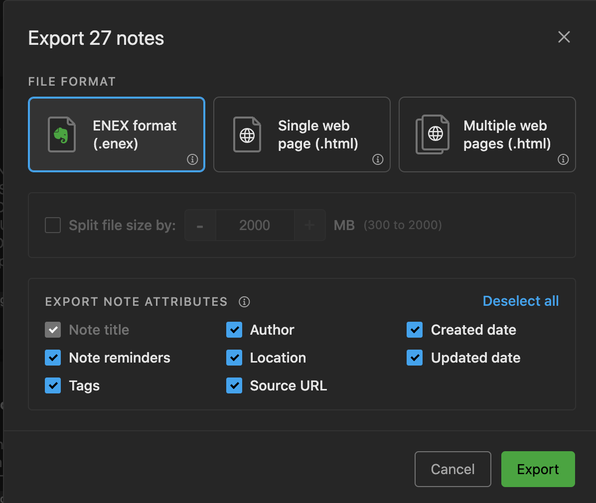

# Request ID Helper

> This has been created on a Mac, for a Mac.

> You will need to use the Evernote Desktop App.  If you don't have this installed, please [visit Evernote's site and download it](https://evernote.com/download)

---

### First Time Setup

1. Hit `Command` and `Spacebar`
2. Type `terminal` and hit `Enter`
3. copy and paste this into your terminal:
```
cd ~/Desktop && curl https://raw.githubusercontent.com/thehandsomezebra/Request_ID_Helper/main/script.sh -O script.sh && chmod +x script.sh
```
> You may need to grant permissions to access your Desktop.

4. You are ready to go!

---

## How to use this tool

1. Open the Evernote app.
2. On the sidebar, right/option click on the Notebook of your choice.

3. Choose to export the .enex file type.

4. Be sure this file is going into your Downloads folder! (This location is important!)

5. Did you follow the steps in the setup?  If you haven't done that, I would recommend scrolling up to the First Time Setup and going thru the steps.  You'll need it to keep going.
6. Now that you have your export file in the *Downloads* folder, and you have the _script.sh_ file... go ahead and click on `script.sh` (which is located on your Desktop) to run it.
7. It will open a terminal and prompt you to pick the correct file -- just type the corresponding number and hit Enter.
8. The script do some magic in the background, and then drop a new file on your Desktop called `output_<timestamp>.csv`
9. Done!


🐙 I hope this helps!


---

## Troubleshooting

- Did you get a bunch of scripty text when you attempted to run it the first time?  
  - Try right/option clicking on the `script.sh` file and choose "Open With >" `Terminal`

- Did you get an error about a file you chose because it had a space in it?
  - Simply rename your file so that it doesn't have a space in it.  Try no spaces or underscores instead.


```
                                                                                                        ░░▒▒▒▒▒▒░░                    
                                                                                                        ▒▒    ▒▒░░░░                  
                                                                                                      ░░        ░░░░░░                
                                                                                                                  ░░░░                
                                                                                                                    ▒▒░░              
                                                                                                                    ▒▒░░              
                                          ▒▒░░░░  ░░▓▓▒▒▒▒                                                          ▒▒░░░░            
                                        ▒▒▒▒▒▒░░▒▒▓▓▒▒▒▒░░░░                                                        ▒▒░░              
                                        ▒▒▓▓▓▓▒▒░░▒▒▒▒▒▒░░░░                                                      ▒▒░░░░              
                                      ▓▓▓▓▒▒▒▒░░▒▒░░▒▒░░▒▒▒▒                                                    ░░▒▒░░░░              
                                    ▒▒▒▒▒▒▒▒▒▒▒▒▒▒▒▒▒▒▒▒▒▒▒▒░░░░                                              ░░▒▒░░░░                
                                  ░░▒▒▒▒▒▒▒▒▒▒▒▒▒▒▒▒▒▒▒▒▒▒▒▒▒▒▒▒▒▒                                          ░░▒▒░░░░                  
                              ░░░░▒▒▒▒▒▒▓▓▒▒▒▒▒▒▒▒▒▒▒▒▒▒▒▒▒▒▒▒▒▒▒▒▒▒░░                                  ▒▒▓▓▒▒░░░░                    
                          ░░░░▒▒▒▒▒▒▒▒▒▒▓▓▒▒▒▒▒▒▒▒▒▒▒▒▒▒▒▒▓▓▒▒▒▒▒▒▒▒▒▒░░░░░░                    ░░░░▒▒▓▓▒▒░░░░  ░░                    
                        ░░░░▒▒▒▒▒▒▒▒▒▒▒▒▒▒▒▒▒▒▒▒▒▒▓▓▓▓▒▒▒▒▒▒▒▒▒▒▓▓▒▒▒▒▒▒▒▒▒▒▒▒▒▒▒▒▒▒▒▒▒▒▓▓▒▒▒▒▒▒▒▒▒▒▒▒▒▒░░░░  ░░                      
                      ░░░░░░▒▒▒▒▒▒▒▒▒▒▒▒▒▒▒▒▒▒▓▓▒▒▒▒▒▒▒▒▓▓▒▒▒▒▒▒▒▒▒▒▒▒▓▓▓▓▒▒▒▒▒▒▒▒▒▒▒▒▒▒▒▒▒▒▒▒▒▒░░░░░░░░░░░░░░                        
                    ░░░░░░▒▒▒▒▒▒▒▒▒▒▒▒▒▒▒▒▓▓▒▒▒▒▓▓▒▒▒▒▒▒▒▒▒▒▓▓▒▒▒▒▒▒▓▓▓▓▒▒▒▒▓▓▒▒▒▒▒▒▒▒▒▒░░░░░░░░░░░░  ░░░░░░                          
                ░░░░░░▒▒▒▒▒▒▒▒▒▒▒▒▒▒▓▓▓▓▓▓▒▒▒▒▓▓▓▓▓▓▒▒▓▓▒▒▓▓▓▓▒▒▒▒▓▓▓▓▓▓▒▒▒▒▒▒▒▒▓▓▓▓▓▓▒▒▓▓░░░░░░▒▒░░░░          ░░▒▒▒▒▒▒▒▒▒▒▒▒▓▓░░    
              ░░▒▒░░░░▒▒▒▒▒▒░░▒▒▒▒▓▓▒▒▒▒▒▒▒▒▓▓▒▒██▓▓▓▓▓▓▒▒░░▓▓  ▓▓▓▓▓▓▓▓▓▓▒▒░░▒▒▒▒▓▓▒▒▒▒▓▓▓▓▓▓▓▓▒▒▒▒▒▒▒▒░░▒▒▓▓▒▒▒▒▒▒░░░░░░░░░░░░▒▒▒▒  
              ░░░░▒▒▒▒▒▒▒▒▒▒░░░░▒▒▒▒▒▒▒▒▒▒▒▒▓▓▓▓▓▓▓▓▓▓▓▓▒▒  ░░░░▒▒░░▓▓▓▓▓▓▒▒▒▒░░▒▒▒▒▒▒▓▓▒▒▒▒▒▒▒▒▒▒▒▒▒▒▒▒▒▒▒▒▒▒▒▒░░░░░░▒▒  ░░░░  ░░▒▒░░
            ░░░░▒▒▒▒▒▒▒▒▒▒▒▒▒▒▒▒▒▒▓▓▓▓▒▒▒▒▒▒▒▒▓▓▓▓▓▓██▒▒  ▒▒░░░░░░░░▒▒▓▓▒▒▒▒▒▒░░░░░░░░░░░░▒▒▒▒▒▒▒▒▒▒▒▒░░░░░░░░  ░░                ░░▒▒
          ░░▒▒▒▒▒▒▒▒▒▒▒▒▒▒▒▒▒▒▒▒▒▒▒▒▒▒▒▒▒▒▒▒░░░░░░▓▓▓▓▒▒  ░░▒▒▓▓  ░░░░▓▓▓▓▒▒▒▒▒▒▒▒▒▒░░░░░░░░░░░░░░░░░░░░░░░░░░            ▒▒░░▒▒▓▓  ▒▒
          ░░▒▒▒▒▒▒▒▒▓▓▒▒▒▒▒▒▒▒▒▒▒▒▒▒▓▓▓▓▒▒▒▒░░░░░░▓▓▒▒░░▒▒▒▒████  ░░▒▒▓▓▓▓▓▓▓▓▒▒▓▓▓▓▒▒▒▒▒▒░░░░  ░░░░  ░░                  ▓▓    ░░▒▒▒▒
        ░░▒▒▒▒▒▒▒▒▒▒▒▒▒▒▒▒▒▒▒▒▓▓▒▒▓▓▓▓▓▓▒▒░░▒▒░░░░░░░░▒▒▒▒▓▓████  ░░░░▓▓▓▓▓▓▓▓▒▒▓▓▓▓▓▓▒▒▒▒░░                              ▒▒░░    ▒▒▒▒
        ░░▒▒▒▒▓▓▒▒▓▓▒▒▒▒▓▓▓▓▓▓▒▒▒▒▓▓▓▓▒▒░░░░▒▒░░░░░░▒▒▒▒▓▓████▓▓▒▒░░▒▒▓▓▓▓▓▓▒▒▒▒▒▒▓▓▒▒▒▒▓▓▒▒░░                              ▒▒▒▒▓▓▒▒  
      ░░░░▒▒▒▒▒▒▒▒▒▒▒▒▒▒▒▒▒▒▓▓▒▒▓▓▓▓▒▒░░▒▒▓▓▒▒▒▒▓▓▓▓▒▒▒▒████▓▓▒▒░░░░░░▓▓▓▓▓▓▓▓▓▓░░▓▓▓▓▓▓▒▒▒▒▒▒▒▒░░                          ░░░░      
      ░░░░▒▒▒▒▒▒▒▒▒▒▒▒▒▒▒▒▒▒▒▒▒▒▓▓▒▒░░▒▒░░░░░░░░▒▒▓▓██████▓▓▒▒▒▒  ▒▒░░░░██▓▓▓▓▓▓░░░░▓▓▓▓▓▓▓▓▒▒▒▒▓▓▒▒▒▒░░                              
      ░░░░▒▒▒▒▒▒▒▒▒▒▒▒▒▒▒▒▒▒▒▒▓▓▒▒░░▒▒░░░░░░░░  ▓▓▒▒████▒▒▒▒▒▒▒▒▒▒░░░░  ▓▓▓▓██▓▓░░  ░░▓▓▓▓▓▓▒▒▒▒▓▓▓▓▒▒▒▒▒▒▒▒                          
      ░░░░▒▒▒▒▒▒▒▒▒▒▒▒▒▒▒▒▒▒▒▒▒▒▒▒░░░░░░░░░░░░  ██░░▓▓▓▓▓▓▓▓▒▒░░    ░░░░  ██▓▓▓▓░░░░    ▒▒▓▓▓▓▓▓▓▓▓▓▓▓▒▒▒▒▒▒▒▒░░                      
      ░░░░░░░░░░░░▒▒░░▒▒▒▒░░▒▒░░▒▒░░░░░░░░░░    ▓▓░░▓▓▓▓▓▓▓▓▒▒░░  ▒▒  ░░▒▒░░▒▒▒▒░░          ░░▒▒▓▓▓▓▓▓▓▓▓▓▓▓▓▓▒▒░░                    
        ░░░░░░░░░░░░░░░░░░░░░░░░░░░░░░░░░░    ▓▓░░▒▒▓▓▓▓▒▒▓▓▒▒        ▒▒  ▒▒░░░░░░░░                    ▓▓▓▓▓▓▒▒▒▒░░                  
        ░░▒▒▒▒▒▒▒▒▒▒▒▒░░░░░░░░░░░░░░░░░░      ▒▒░░▓▓▓▓▒▒▒▒▒▒▒▒        ▒▒░░  ▒▒░░                            ██▓▓▒▒░░                  
      ░░▒▒▒▒▒▒▒▒▒▒▒▒▒▒▓▓░░░░▓▓░░░░░░        ▓▓░░░░▓▓▓▓▒▒▒▒▒▒        ▒▒▒▒▒▒░░░░░░░░                            ▓▓▓▓▒▒                  
      ▒▒▒▒▒▒░░          ░░▓▓▓▓▓▓▒▒░░▓▓░░  ▓▓░░░░░░▓▓▒▒▒▒▓▓▒▒  ░░▒▒▒▒▒▒░░░░  ▒▒░░    ░░▒▒▒▒░░            ▓▓▓▓▓▓▓▓▓▓▒▒                  
      ▒▒    ░░        ░░░░░░░░▒▒▒▒▒▒▒▒▒▒▓▓░░░░░░▓▓▓▓▓▓▒▒▓▓▒▒▒▒▒▒▒▒░░░░░░░░░░    ▒▒▓▓▓▓▒▒▒▒▒▒▒▒        ▒▒▒▒░░  ▒▒▓▓▒▒                  
    ░░  ░░░░            ░░░░░░░░░░▒▒▒▒░░░░  ▒▒░░▓▓▒▒▓▓▒▒▓▓░░░░░░░░░░  ░░      ▓▓▓▓▒▒▒▒    ░░▒▒░░      ▒▒░░    ░░▓▓▒▒                  
                        ░░  ░░  ░░░░░░  ░░░░░░░░▓▓▓▓▒▒▓▓░░░░░░░░░░░░░░      ▓▓▒▒▒▒░░        ░░▒▒      ░░▒▒░░  ▓▓▒▒░░▒▒░░              
            ▒▒▒▒▒▒▒▒▒▒▒▒░░▒▒░░░░░░  ░░░░░░  ░░░░▓▓▒▒▓▓▓▓░░░░            ░░▓▓▒▒▒▒              ▒▒        ▒▒▒▒▒▒▒▒░░      ░░▒▒░░        
        ▒▒░░        ░░▒▒▓▓▒▒░░░░▒▒  ▒▒░░  ░░    ▓▓▓▓▓▓▒▒░░            ▓▓▒▒▒▒▒▒                ▒▒            ░░                        
      ▒▒                                        ▓▓▓▓▓▓▓▓▓▓        ░░▒▒▒▒▒▒▒▒                  ░░                                      
                                                ▒▒▒▒▓▓▒▒▓▓▓▓▒▒▓▓▓▓▒▒▒▒▒▒░░                                                            
                                                  ▓▓▓▓▒▒▓▓▓▓▒▒▓▓▒▒▒▒▒▒░░                                                              
                                                  ░░▒▒▒▒▒▒▓▓▓▓▒▒▒▒▒▒▒▒                                                                
                                                    ░░▒▒▒▒▓▓▓▓▒▒▒▒░░                                                                  
```